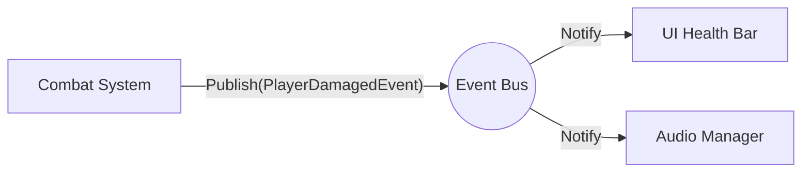
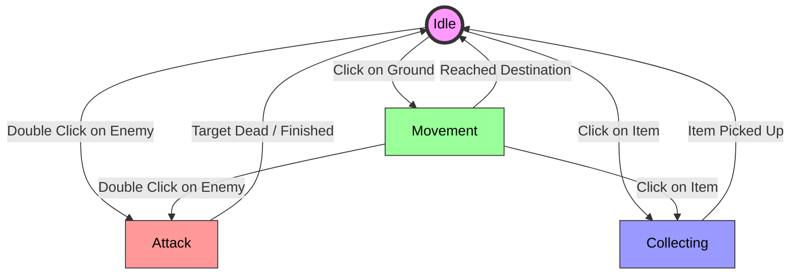

# Action RPG "Hero Tournament"

A modular top-down action rpg prototype built with Unity.  
The project focuses on scalable combat architecture, clean code structure, and extensible gameplay systems.

---


---

## Overview

This project demonstrates:

- SOLID principles 
- ScriptableObject-based systems
- Context-driven combat logic
- Dependency Injection architecture
- Finite State Machine (FSM) player, enemy and friendly summons controller
- Event-driven systems
- Clear separation between data and runtime logic
- Save/load system via Firebase realtime database
- Memory & Life-cycle management: Use of CancellationToken to prevent async leaks and null-reference exceptions on destroyed objects

The goal is to simulate production-level architecture within a small but expandable gameplay prototype.

---

## Tech Stack

- | ***Engine***	| --> Unity 6000.45 (URP) |
- | ***Language*** | -->	C# |
- | ***Architecture*** | -->	Zenject (DI), FSM, Observer, Context Object, etc |
- | ***Async Logic*** | -->	UniTask (Allocation-free async/await, cancellation tokens) |
- | ***Persistence*** | -->	Firebase Realtime Database |
- | ***Input & Camera*** | -->	New Input System, Cinemachine 3 |

---

## Core Features

###  Spell System (ScriptableObject Architecture)

Spells inherit from a base `SpellSO` abstraction.

Each spell:
- Encapsulates its own behavior
- Operates via `PlayerSpellContext`
- Is easily extendable without modifying existing systems

Example:

```csharp
namespace Assets.Scripts.Runtime.SOScripts.SpellSOs.Spells
{
    [CreateAssetMenu(fileName = "IceShackles", menuName = "Wizard Spells/IceShackles")]
    public class IceShacklesSO : SpellSO
    {
        [SerializeField] private EnemyStatusEffectSO _statusEffect;
        public override void Activate(PlayerSpellContext ctx)
        {
            ctx.Audio.PlaySpellAudio(this, ctx.EnemyTransform);
            ctx.EnemyStatusEffectsManager.ApplyStatusEffect(_statusEffect);
        }
    }
}
```
Config example:


This architecture allows:


- Adding new spells without editing core combat systems
- Data-driven configuration
- Better maintainability
- Cleaner separation of gameplay logic

---

###  Observer Pattern (Global Event Bus)

A centralized **Event Bus** handles communication between independent systems to maintain loose coupling.

- Loose Coupling: Systems publish events (e.g., `PlayerDamagedEvent`) without needing references to listeners like UI or Audio modules.
- Zenject Integration: The `EventBus` is registered as a global service and injected into any class that needs to subscribe or publish.
- Type-Safety: Events are defined as specific classes, ensuring safety during compile-time and refactoring in Visual Studio.

Example:

```csharp
_eventBus.Publish(new PlayerDamagedEvent { DamageAmount = 15f, CurrentHealth = 85f });

_eventBus.Subscribe<PlayerDamagedEvent>(OnPlayerDamaged);
```

Graph example(very simplified):



---

### Dependency Injection (Zenject)

The project uses Zenject to:

- Inject core services and components (AudioManager, EventBus, Spawn Managers, Player components)
- Reduce scene-level coupling
- Avoid singleton use
- Improve testability and scalability
- Use Zenject factories to manage object lifecycle and dependency resolution 

Dependencies are explicit and managed through installers rather than hard-coded references.

Example:

```csharp
namespace Assets.Scripts.Runtime.DI.MonoInstallers
{
    public class ManagersInstaller : MonoInstaller
    {
        public override void InstallBindings()
        {
            Container.Bind<FirebaseManager>().FromNew().AsSingle().NonLazy();
            Container.Bind<GameManager>().FromComponentInHierarchy().AsSingle().NonLazy();
            Container.Bind<AudioManager>().FromComponentInHierarchy().AsSingle().NonLazy();
            Container.Bind<EnemySpawnManager>().FromNew().AsSingle().NonLazy();
            Container.Bind<ItemSpawnManager>().FromNew().AsSingle().NonLazy();
            Container.Bind<PlayerSaveManager>().FromNew().AsSingle().NonLazy();
            Container.Bind<LevelSaveManager>().FromNew().AsSingle().NonLazy();
            Container.Bind<GlobalSaveManager>().FromComponentInHierarchy().AsSingle().NonLazy();
            Container.Bind<ViewManager>().FromNew().AsSingle().NonLazy();
        }
    }
}
```

---

### Finite State Machine (FSM)

Player and other controllers are implemented using a state-based architecture.

The structure allows easy expansion (e.g., roll, abilities, stun states).

Benefits:

- Predictable behavior
- Clear transitions
- Better separation of responsibilities
- Reduced complexity in the main controller
- Allows centralizing shared creature behavior in a base state classes to reduce code duplication and enable controlled overrides in derived states

Example of Abstract Base State Machine Class: 

```csharp 
 namespace Assets.Scripts.Runtime.BaseLogic
 {
    public abstract class StateMachineBase<TState> : MonoBehaviour where TState : class, IState
    {
        public TState CurrentState { get; private set; }

        protected virtual void Update()
        {
            CurrentState?.Update();
        }

        public void ChangeState(TState newState)
        {
            if (CurrentState == newState) return;

            CurrentState?.Exit();

            CurrentState = newState;
            CurrentState.Enter();
        }
    }
 }
```

Graph example(very simplified):


---
### Cloud Persistence System (Firebase Integration)

The project features a robust Save/Load pipeline using Firebase Realtime Database, ensuring player progress is synchronized and persistent across sessions.

Benefits:

- Asynchronous Data Handling: Leverages UniTask to perform non-blocking network operations, preventing frame drops during cloud synchronization.
- Data Serialization: Custom data structures (Stats, Talents, Inventory) are serialized into JSON format for efficient cloud storage.
- Security & Scalability: Implements a dedicated SaveManagers for various components that are handling unique records and data integrity checks.

Example: 

```csharp
  public async UniTask SavePlayerDataToFirebaseAsync(PlayerSaveData playerData, CancellationTokenSource cts)
  {
      try
      {
          var db = FirebaseBootstrap.Db;
          var uid = FirebaseBootstrap.Uid;

          string jsonKey = JsonUtility.ToJson(playerData);
          await db.Child($"users/{uid}/PlayerData")
               .SetRawJsonValueAsync(jsonKey)
               .AsUniTask().AttachExternalCancellation(cts.Token);
      }
      catch (OperationCanceledException)
      {
          Debug.LogError("Saving cancelled");
      }
      catch (Exception ex)
      {
          Debug.LogError($"Saving failed, reason: {ex}");
      }
  }
```

Database Screenshot:


---

## Project Structure

```
Assets/
 ├── Scripts/
 │   ├── Core/
 │   ├── Runtime/
 ├── SO(ScriptableObjects)/
 ├── Art/
 ├── Prefabs/

 ...
```

Structure separates:

- Core abstractions
- Runtime behavior
- ScriptableObject data
- System-level services
- Art components and prefabs
---

## How to Run

1. Open the project in Unity 6000.45+  
2. Press Play  

---

## Roadmap

- More items
- Item equip system
- Item hotkeys
- Upgrade UI design
---

## License

Personal portfolio project. Developed by Maksym Linynskyi (2025-2026).
